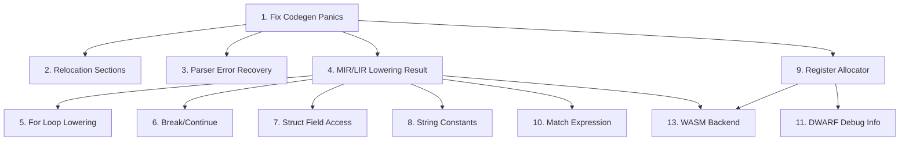

# Prioritas Jangka Pendek — Brak Language Construction Toolkit

## P0 — Critical (Compiler Crashes / Panic)

### 1. Fix Codegen Panics — 18 `.unwrap()` + 3 `.expect()` di `x86_64.rs`
- **File**: `brak-codegen-obj/src/x86_64.rs`
- **Masalah**: `emit_text()` dan `emit_function()` return `(Vec<u8>, Vec<Reloc>)` (infallible) — semua error IcedError di-unwrap, `inst.dest` di-unwrap, label parsing di-expect. Compiler panic pada LIR invalid.
- **Solusi**: Buat `CodegenError` enum, ubah semua signature ke `Result<_, CodegenError>`, propagasi ke `elf.rs`/`coff.rs`/`macho_obj.rs`/`lib.rs`.
- **Detail**: lihat plan yang sudah disusun.

### 2. Relocation Sections — Multi-Object Linking Gagal
- **Files**: `brak-codegen-obj/src/elf.rs`, `coff.rs`, `macho_obj.rs`
- **Masalah**: `.rela.text` section dihasilkan tapi relocations belum lengkap (r_info pakai `1u64` untuk non-relative, addend `-4` hardcoded). COFF relocations hanya support nama pendek. Mach-O relocations belum diisi (`nreloc = 0`).
- **Dampak**: Fungsi eksternal tidak bisa di-link. `call` ke fungsi di object file lain salah.
- **Solusi**: Verifikasi reloc offset dan jenis (R_X86_64_PC32/R_X86_64_PLT32). Fix COFF strtab lookup. Isi Mach-O reloc section.

### 3. Parser Error Recovery — `Result<Program, String>` Bukan Diagnostics
- **File**: `brak-frontend/src/parser.rs`
- **Masalah**: Parser return `Result<T, String>` — error pertama langsung stop, tidak ada koleksi multiple errors, tidak ada span.
- **Dampak**: 1 syntax error per kompilasi. Developer experience buruk.
- **Solusi**: Ganti ke `Diagnostics` collector dari `brak-core`. Semua error parsing dikoleksi + dilaporkan sekaligus.

### 4. MIR/LIR Lowering Infallible — Silent Wrong Code
- **Files**: `brak-ir-mir/src/lower.rs`, `brak-ir-lir/src/lower.rs`
- **Masalah**: `MirLower::lower()` dan `LirLower::lower()` return `T` (bukan `Result<T>`). Invalid HIR/MIR menghasilkan panic atau code salah secara diam-diam.
- **Dampak**: Compiler tidak bisa mendeteksi IR lowering error.
- **Solusi**: Ubah signature ke `Result<T, Diagnostics>`, validasi invariant di lowering.

---

## P1 — High (Missing Language Features)

### 5. For Loop Lowering — HIR → MIR (CFG)
- **Files**: `brak-ir-hir/src/lower.rs`, `brak-ir-mir/src/lower.rs`
- **Status**: AST sudah punya `Expr::For`, HIR sudah punya `HirStmt::For`. Tapi MIR lowering masih `todo!()` atau skip.
- **Dampak**: `for i in 0..10 {}` tidak jalan.
- **Solusi**: Lower `for` ke MIR CFG: `let mut i = start` → `block: if i < end { body; i += 1; jmp block }`.

### 6. Break/Continue — Missing Terminators
- **Files**: `brak-ir-hir/src/lower.rs`, `brak-ir-mir/src/lower.rs`
- **Status**: AST/HIR punya `Break`/`Continue`. Tapi MIR lowering tidak handle loop context.
- **Dampak**: `break` dan `continue` di dalam loop tidak berfungsi.
- **Solusi**: Stack loop context di MirLower, mapping `break` → jump ke after-loop block, `continue` → jump ke loop-header block.

### 7. Struct Field Access — Field Offset + Load/Store [DONE]
- **Status**: SELESAI di Phase 9 Infrastructure.
- **Dampak**: Struct sekarang bisa didefinisikan, diinisialisasi, dan diakses field-nya (read/write).

### 8. String Constants — `.rodata`/`.data` Section
- **Files**: `brak-ir-lir/src/lower.rs`, `brak-codegen-obj/src/x86_64.rs`, `brak-codegen-obj/src/elf.rs` dkk
- **Status**: `LirOperand::Label` untuk string tapi tidak ada section data. Hanya `Comment` di LIR.
- **Dampak**: String literal tidak bisa di-compile.
- **Solusi**: Tambah `LirData` section di LIR program. Codegen emit `.rodata` dengan string data + label. Pointer ke data section.

---

## P2 — Medium (Code Quality & Performance)

### 9. Register Allocator — Modulo-8 → Linear Scan
- **File**: `brak-codegen-obj/src/x86_64.rs` (fungsi `phys()`)
- **Sekarang**: `reg & 7` — semua virtual register di-mapping ke 8 physical register. Register pressure tinggi.
- **Dampak**: Stack spill untuk semua reg > 8. Kinerja buruk.
- **Solusi**: Implement linear scan register allocator. Analisis live interval per basic block.

### 10. Match Expression — Pattern Matching
- **Files**: `brak-ir-hir/src/lower.rs`, `brak-ir-mir/src/lower.rs`
- **Status**: Selalu ambil arm pertama. Tidak ada pattern matching.
- **Dampak**: `match x { 1 => ..., 2 => ... }` selalu execute arm 1.
- **Solusi**: Generate MIR CFG dengan switch/branch per arm. Pattern: literal comparison, wildcard fallthrough.

### 11. DWARF Debug Info
- **File**: semua `brak-codegen-obj/src/*.rs`
- **Status**: Tidak ada DWARF sections.
- **Dampak**: Debugger (GDB/Lldb) tidak bisa step-through Brak code.
- **Solusi**: Generate `.debug_info`, `.debug_abbrev`, `.debug_line`, `.debug_str` sections dari `Span`/`SourceMap`.

### 12. File I/O Error Handling — `.expect()` di `brak-tool`
- **File**: `brak-tool/src/main.rs`
- **Masalah**: Beberapa `.expect()` dan `.unwrap()` di CLI code (`file_stem().unwrap()`, `extension().unwrap()`).
- **Dampak**: CLI crash pada file path invalid.
- **Solusi**: Ganti dengan error message yang proper + graceful exit.

---

## P3 — Low (Nice To Have)

### 13. WASM Backend — `brak-codegen-wasm`
- **Crate baru**: Target `wasm32-unknown-unknown`. Emit wasm binary module.
- **Dampak**: Brak bisa running di browser.
- **Blokir**: Belum ada plan ABI mapping ke WASM.

### 14. C Backend — `brak-codegen-c`
- **Crate baru**: Emit C source code (bukan binary). Berguna untuk FFI.
- **Dampak**: Brak function bisa di-compile ke C library.

### 15. Inline Tests — Test Helper di `brak-test`
- **File**: `brak-test/src/lib.rs`
- **Sekarang**: Snapshot/Diagnostic/Execution tester sudah ada tapi harus bikin file test sendiri.
- **Solusi**: Macro `brak_test!` yang inline source code + assertions.

### 16. Parser — Support Full Error Recovery
- **File**: `brak-frontend/src/parser.rs`
- **Sekarang**: Single error.
- **Solusi**: Multiple error collection + token skipping untuk recovery.

---

## Dependency Graph

**Urutan pengerjaan**: P0.1 → (P0.2, P0.3, P0.4 paralel) → P1 → P2 → P3

---

## File Referensi

| Prioritas | File | Baris Kritis |
|-----------|------|-------------|
| P0.1 | `brak-codegen-obj/src/x86_64.rs` | 19,33,86,95,96,98,99,102,106,107,109,113,114,115,117,165,182,188,195,196,331 |
| P0.2 | `brak-codegen-obj/src/elf.rs` | 23,200,376 |
| P0.2 | `brak-codegen-obj/src/coff.rs` | 4,125,141 |
| P0.2 | `brak-codegen-obj/src/macho_obj.rs` | 4,78 |
| P0.3 | `brak-frontend/src/parser.rs` | seluruh file |
| P0.4 | `brak-ir-mir/src/lower.rs` | seluruh file (infallible) |
| P0.4 | `brak-ir-lir/src/lower.rs` | seluruh file (infallible) |
| P1.5 | `brak-ir-mir/src/lower.rs` | `For` handling |
| P1.6 | `brak-ir-mir/src/lower.rs` | `Break`/`Continue` handling |
| P1.7 | `brak-ir-hir/src/lower.rs` | struct lowering |
| P1.8 | `brak-ir-lir/src/lir.rs` | tambah `LirData` |

---

> **Catatan**: Saat ini kita sedang mengerjakan **P0.1 — Fix Codegen Panics**. Detail implementasi sudah dibahas. Lanjut eksekusi setelah prioritas ini disetujui.
