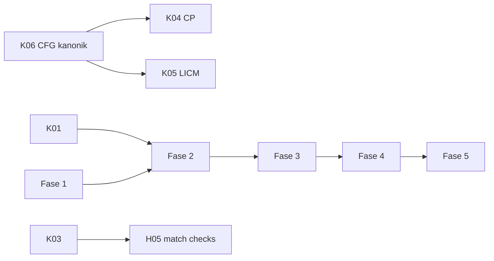

# Prioritas & Registry Bug — Brak Language Construction Toolkit

> **Status dokumen**: Hasil audit menyeluruh seluruh workspace (30 crate), dibuat setelah
> review kode baris-per-baris. Dokumen ini **menggantikan** registry lama; item lama yang
> masih relevan dimigrasi ke ID baru (lihat tabel migrasi di akhir).
>
> Format entri bug:
> ```
> ### BUG-XXX: judul singkat
> - Lokasi: file:baris
> - Root cause: penyebab teknis
> - Dampak: efek pada user/program
> - Repro: cara memicu
> - Fix: desain solusi teknis
> - Test: cara memverifikasi fix
> ```

---

# BAGIAN A — BUG REGISTRY

## Level K — KRITIS: Silent Miscompile (hasil program salah tanpa error)

### BUG-K01: `return` di dalam loop diturunkan sebagai back-edge (jadi `continue`)
- **Lokasi**: `brak-ir-mir/src/lower.rs:277-285` (while), `:384-411` (for), `:445-453` (loop)
- **Root cause**: Lowering loop menulis ulang terminator blok berdasarkan *kind*
  (`MirTerminator::Return`) menjadi jump balik ke header loop. Path if-statement
  (`lower.rs:208,219`) sudah benar — mengecek `name == "unreachable"` — tapi path loop
  tidak. Inkonsistensi antar dua jalur lowering yang sama.
- **Dampak**: Fungsi dengan `return x;` di dalam while/for/loop **tidak pernah return**
  dari fungsi; eksekusi loop terus.
- **Repro**: `fn f(n: i32) -> i32 { while true { return 5; } }`
- **Fix**: Simpan loop context stack `{ continue_target, break_targets }`. Terminator
  `Return` di dalam body loop **tidak boleh** disentuh oleh transformasi loop — hanya
  `Continue` yang diarahkan ke header, dan hanya jika berasal dari stmt `continue`.
  Terapkan penandaan saat emit stmt (bukan post-pass di atas terminator).
- **Test**: `cargo test -p brak-test` + test baru: fungsi loop-with-return harus menghasilkan
  exe yang exit code 5.

### BUG-K02: If-expression hijack control flow — merge block terminated `Return`
- **Lokasi**: `brak-ir-mir/src/lower.rs:842-856`
- **Root cause**: Ketika `if` dipakai sebagai *expression* (bukan statement), block merge
  yang menampung hasil diterminasi `Return(result_local)` alih-alih fall-through ke block
  lanjutan.
- **Dampak**: `let y = if c { 1 } else { 2 }; more_code();` — eksekusi berhenti di `if`,
  `more_code()` tidak pernah jalan. Return palsu dari fungsi induk.
- **Fix**: Merge block diterminasi `Goto(next)`; hasil disimpan di local temp; expression
  lowering mengembalikan local id tersebut. Butuh mekanisme "expression slot" pada
  MirLower (sudah sebagian ada via locals).
- **Test**: Program dengan if-expression mid-function + stmt sesudahnya.

### BUG-K03: `match` tidak berfungsi — scrutinee dibuang, selalu arm pertama
- **Lokasi**: `brak-ir-mir/src/lower.rs:675-692`; pattern→string di `brak-ir-hir/src/lower.rs:273-284`
- **Root cause**: HIR lower mengubah semua pattern jadi `to_string()` (string literal) —
  informasi struktur pattern hilang. MIR lower mengevaluasi scrutinee lalu tidak pernah
  membandingkannya; langsung goto arm[0].
- **Dampak**: `match x { 1 => a, _ => b }` **selalu** menghasilkan `a`, apapun nilai `x`.
- **Fix (berjenjang)**:
  1. HIR: ganti `HirPattern::Lit(String)` dengan enum nyata:
     `enum HirPattern { Wildcard, Literal(HirLiteral), Binding(String), Variant { enum_name, variant } }`.
  2. MIR: generate CFG per-arm — chain of `Cmp scrutinee, lit → branch arm_i / next_arm`;
     wildcard = unconditional. Urutan arm = urutan source.
  3. Exhaustiveness check di typeck (BUG-H05) — bisa menyusul.
- **Test**: match dengan 3+ arm literal + wildcard; assert hasil benar untuk tiap nilai.

### BUG-K04: Constant Propagation path-insensitive → nilai salah lintas cabang
- **Lokasi**: `brak-opt-cp/src/lib.rs:21-89`
- **Root cause**: Pass 1 iterasi instruksi secara linear dan menyimpan konstanta register
  dalam satu map function-global. Assignment di satu cabang (`if c { r = 5; }`) dianggap
  berlaku global. Juga fold `a+b`/`a*b` mode wrapping tanpa mencocokkan semantik runtime.
- **Dampak**: Silent miscompile pada program apa pun yang mengassign variabel secara
  kondisional. **Pass aktif by default** (`brak-easy/src/lib.rs:30,37`).
- **Fix**: Dataflow analysis berbasis CFG: worklist algorithm, lattice per-register
  (`Top | Const(v) | Bottom`), meet-function = union (join) pada merge point.
  Reuse CFG builder hasil BUG-H06. Sementara sebelum fix: **matikan CP dari default
  pipeline** (satu baris di brak-easy).
- **Test**: Differential test vs interpreter MIR sederhana; khususnya kasus
  conditional-assign.

### BUG-K05: LICM hoist instruksi trapping/mutating
- **Lokasi**: `brak-opt-licm/src/lib.rs:130-136` (eligibility), `:45-49` (pre-header)
- **Root cause**:
  1. Eligibility mengecualikan `Call/Store` tapi bukan `Div/Mod` (bisa div-by-zero saat
     loop 0 iterasi), `Load`, atau `SetField` (mutasi dieksekusi 1× alih-alih N×).
  2. Pre-header diambil `outside_preds[0]` — dengan >1 outside pred, hoisted code tidak
     mendominasi header.
- **Fix**: Whitelist ketat: hanya `BinOp` pure (`Add/Sub/Mul/And/Or/Xor/Shl/Shr`) dengan
  operand Imm/Reg non-trapping. Buat pre-header block baru eksplisit, redirect semua
  outside preds ke sana.
- **Test**: Loop 0 iterasi berisi `x / z` dengan `z == 0` — program harus tetap jalan.

### BUG-K06: `build_cfg` tidak resolve jump edges — CFG kosong untuk output LIR asli
- **Lokasi**: `brak-opt-utils/src/lib.rs:20-60` vs `brak-ir-lir/src/lower.rs:157,167-168`
- **Root cause**: `build_cfg` resolve label **hanya via block name**, padahal LIR asli
  emit label `block_{id}`. Jump edge tak kunjung ketemu → CFG cuma punya fall-through.
  DCE punya builder duplikat sendiri yang benar (`compute_successors`,
  `brak-opt-dce/src/lib.rs:93-104`) — dua implementasi divergen.
- **Dampak**: LICM/JT no-op diam-diam; analisis apa pun di atas CFG salah. Ini root
  cause dari separuh masalah optimasi.
- **Fix**: Satu fungsi kanonik `build_cfg(lir_fn) -> Cfg` di `brak-opt-utils` yang
  resolve label **by name DAN by id** (parse `block_N`). Hapus `compute_successors`
  duplikat di DCE, panggil util bersama. Semua pass (CP dataflow baru, LICM, JT, DCE)
  konsumen util ini.
- **Test**: Unit test build_cfg terhadap fungsi LIR hasil `LirLower` nyata (bukan hand-made).

### BUG-K07: Inliner merusak operand Label non-block
- **Lokasi**: `brak-opt-inline/src/lib.rs:71-77,115-121`
- **Root cause**: SEMUA operand `Label` dilewatkan `rewrite_lbl`, termasuk callee target
  `Call printf` dan nama struct `StructInit Point` → jadi `fmain.b5_printf`, dst → simbol
  unresolved saat link/codegen.
- **Root cause tambahan**: continuation block hanya dibuat jika ada instruksi setelah call
  (`:131-139`); tail call tanpa konten → `Ret` menuju label yang tidak ada. Mutual
  recursion tidak dibatasi (guard cuma self-recursion `:42`); argumen kurang silently
  skipped (`:81-85`).
- **Fix**:
  1. Bedakan "label internal" (prefix `block_` atau terdaftar di `callee.labels`) vs
     "simbol global" (fungsi/struct/string) — hanya yang internal direwrite.
  2. Selalu buat continuation block setelah inline (boleh kosong + Goto berantai,
     dibersihkan pass lain).
  3. Recursion depth budget per-call-site (mis. max depth 3, hitung via map
     caller-chain). Argumen mismatch → skip inlining (bukan skip argumen).
- **Test**: Inline fungsi yang memanggil fungsi eksternal + pakai struct; mutual
  recursion `a↔b` harus terminate kompilasi.

### BUG-K08: Register allocator asm backend aliasing — vreg share reg fisik
- **Lokasi**: `brak-codegen-asm/src/regalloc.rs:14-21` (`virt % 15`)
- **Root cause**: Mapping modulo tanpa liveness. Vreg 0 dan 15 sama-sama `rax` — nilai
  saling menimpa.
- **Bug tambahan di `x86_64.rs` backend ini**:
  - Epilogue tunggal di akhir; `Ret` mid-function (`:71-78`) tidak restore rsp/rbp.
  - `Div` (`:50`) lewat path generik tanpa setup `rax`/`cqo` (hanya `Mod` yang benar, `:115-126`).
  - `Call` (`:127-163`) menaruh args di rax..r9 yang juga allocatable → clobber live value;
    tanpa caller-saved preservation; tanpa alignment 16-byte.
  - Offset param `frame_size-(param+1)*8` negatif untuk frame besar → tulis di bawah rsp.
  - `Load/Store/Alloca/GetField/SetField/StructInit` → `"nop"` — dibuang diam-diam.
- **Fix (bertahap)**:
  1. Minimal viable: spill-all — setiap vreg dapat stack slot; load sebelum use, store
     setelah def. Benar walau lambat, menghapus aliasing & param-offset bug.
  2. Linear scan allocator (BUG-M08) untuk performa.
  3. Epilogue per-Ret (emit prologue mirror di tiap Ret) sampai ada block-merge.
- **Test**: Golden assembly test: fungsi dengan >15 vreg hidup simultan; hasil run
  harus benar.

### BUG-K09: Backend obj membuang opcode — Shl/Shr/Push/Pop/field ops hilang
- **Lokasi**: `brak-codegen-obj/src/x86_64.rs` — dispatch binop `:317-322` berakhir di Xor,
  catch-all `_ => {}` di `:530`
- **Dampak**: `x << n` dikompilasi jadi tidak melakukan apa-apa (nilai input dibiarkan).
  Sama untuk Push/Pop/Alloca/GetField/SetField/StructInit.
- **Fix**: Lengkapi dispatch: Shl/Shr → `shl/shr cl` (rcx staging); GetField/SetField →
  lea+offset mov; StructInit → memset/seri mov. Catch-all `_ => {}` diganti
  `unimplemented!("opcode {:?}")` agar tidak pernah silent lagi.
- **Test**: Per-opcode round-trip test: LIR → obj → link → run → assert hasil.

### BUG-K10: Backend LLVM menghasilkan IR invalid
- **Lokasi**: `brak-codegen-llvm/src/lib.rs:130-133,168-171,182-189,315-329`
- **Root cause**: Parameter SSA di-store "through" dirinya sendiri (`store i64 %r0, i64* %r0`);
  float typing campur (`icmp ... i64` atas nilai double); `Set*` tanpa `Cmp` pendahulu
  di blok sama → dest tak terdefinisi.
- **Dampak**: Semua `.ll` berisi fungsi berparameter gagal verifikasi `llvm-as`/`opt`.
- **Fix**: Alloca entry-block untuk tiap parameter + store awal (pola clang -O0);
  reg_type konsisten per-instruksi (tabel tipe per-vreg); Set* fallback `icmp eq i64 0,0`.
- **Test**: Emit .ll → pipe ke `llvm-as` (jika tersedia) atau verifier minimal; minimal
  snapshot test struktur.

### BUG-K11: Backend WASM invalid — urutan stack & binary format
- **Lokasi**: `brak-codegen-wasm/src/lib.rs:263-269` (reinterpret sebelum const),
  `:199-245` (state Cmp/Set lintas-instruksi rapuh), `:82-96` (offset data vs escaping)
- **Dampak**: Modul float literal invalid; data overlap saat string berisi quote/newline;
  import signature hardcoded 6×i64.
- **Fix**: Push `f64.const` dulu baru reinterpret (atau hapus reinterpret, gunakan i64
  reinterpret yang benar); Cmp/Set digabung satu pseudo-instruction saat lowering LIR→WASM;
  escape string saat hitung panjang byte. Binary encoding penuh (type/function/memory/
  export/code sections) menggantikan output WAT-as-.wasm — atau rename output `.wat`.
- **Test**: Parse ulang output dengan parser minimal; float program end-to-end.

## Level H — HIGH

### BUG-H01: Linker WASM korup (remap index tidak diimplementasi)
- **Lokasi**: `brak-link-wasm/src/lib.rs:142-148,164-197,90-103,265`
- **Detail**: remapped_indices hanya copy verbatim meski type section deduped/reordered;
  code bodies diambil sebagai section utuh termasuk count prefix lalu dibungkus count lagi
  (double-nested); section memory/global/data dibuang; `rename_export` pad NUL tanpa ubah
  length LEB128 → nama export `"main\0\0"`.
- **Fix**: Implement true remap: map old_type_idx→new via HashMap saat dedup; parse
  per-body (count, size, bytes) lalu rebuild; preserve semua section; rename = re-encode
  LEB128 length.
- **Test**: Merge 2 modul fixture; validasi dengan decode LEB128 manual / wasm-tools jika ada.

### BUG-H02: `--shared` menghasilkan executable, bukan shared library
- **Lokasi**: `brak-tool/src/main.rs:355-362`
- **Detail**: Memanggil `NativeLinker::link()` yang sama dengan exe; tidak ada PE
  characteristics IMAGE_FILE_DLL / ELF ET_DYN; output `.so` bahkan di Windows.
- **Fix**: Tambah `link_shared()` di NativeLinker: PE → DLL flag + export table dari
  simbol publik; ELF → ET_DYN + .dynamic minimal. Sampai selesai: error jelas
  "`--shared` belum didukung" daripada output bohong.
- **Test**: Build dll → cek PE header Characteristic bit 0x2000.

### BUG-H03: Input archive (.a/.lib) tidak pernah diparse
- **Lokasi**: `brak-tool/src/main.rs:252-254`
- **Detail**: Byte archive langsung diteruskan ke link_pe/link_elf yang expect COFF/ELF
  object → selalu gagal.
- **Fix**: Deteksi magic `!<arch>` → iterate member via brak-link-archive parser → feed
  tiap object ke linker. Symbol-table index archive (saat ini fake, BUG-M09) tidak wajib
  untuk linking linear.
- **Test**: Link exe dari .a yang dibuat brak sendiri.

### BUG-H04: Relocation addend diabaikan di ELF/Mach-O
- **Lokasi**: `brak-link-native/src/parse.rs:469-500` (`// A = 0`), addend RelaEntry
  di-parse (`:156`) tapi tak pernah dipakai; Mach-O addend diasumsikan 0 (`:278-294`)
- **Dampak**: Link objek ELF conforming (addend PC32 = −4) menghasilkan alamat salah.
  Latent ABI bug untuk janji "link any ELF object".
- **Fix**: `apply_reloc` menerima addend: `S + A - P`. Untuk reloc yang di-generate sendiri
  (addend 0) tidak berubah perilaku.
- **Test**: Fixture .o buatan gas/clang (jika toolchain ada) atau synthetic ELF fixture
  dengan addend −4.

### BUG-H05: Type checker bocor — scoping, missing-return, int literal
- **Lokasi**: `brak-ir-hir/src/typeck.rs:9,57-63,55-70,143,162,207-212,292-303,39`
- **Detail**:
  1. Flat `locals` map — tanpa push/pop scope; shadowing & out-of-scope unchecked.
  2. Non-void fn boleh jatuh dari akhir tanpa return.
  3. break/continue di luar loop tidak ditolak.
  4. Int literal selalu I32 → `let x: i64 = 5;` ditolak.
  5. And/Or typed Bool untuk operand apa pun, padahal dikompilasi bitwise.
  6. Match pattern type di-infer lalu dibuang; tidak ada exhaustiveness.
  7. Duplikat fn name menimpa diam-diam di map.
- **Fix**: Struktur `ScopeStack` (Vec<HashMap>) — prasyarat refactor typeck/scopes.rs
  (Bagian C). Literal typing: untyped-int yang unifies dengan expected type; default I32.
  Missing-return: cek terminator semua path (CFG sederhana). Item 6 menunggu BUG-K03.
- **Test**: Kasus negatif per item (harus error compile).

### BUG-H06: find_entry_offset return 0 diam-diam saat simbol entry tak ada
- **Lokasi**: `brak-link-native/src/parse.rs:459-467`
- **Dampak**: Start stub memanggil offset 0 → crash aneh / infinite loop, bukan pesan
  "undefined symbol: main".
- **Fix**: Return `Result<usize>`; error berisi nama entry. Caller (pe.rs/elf.rs) laporkan
  sebagai link error.
- **Test**: Link tanpa main → stderr berisi "undefined symbol".

### BUG-H07: COFF parser menandai semua simbol global
- **Lokasi**: `brak-link-native/src/parse.rs:365` (`st_info: STB_GLOBAL << 4` unconditionally)
- **Dampak**: Simbol lokal ikut masuk `build_global_sym_map` → shadowing lintas object,
  mis-link diam-diam.
- **Fix**: Map storage class COFF → binding: IMAGE_SYM_CLASS_STATIC (dan section syms) =
  LOCAL; EXTERNAL = GLOBAL.
- **Test**: Dua object dengan static same-name symbol; tidak boleh conflict.

### BUG-H08: brak-easy menjalankan pass hingga 16× (loop ganda)
- **Lokasi**: `brak-easy/src/lib.rs:171-174` × `brak-opt-traits/src/lib.rs:71`
- **Detail**: `PassManager::run` sudah iterate `max_iterations`; EasyPipeline membungkusnya
  lagi dalam `for _ in 0..pm.max_iterations`.
- **Fix**: Hapus loop luar. O(n²) compile time hilang.
- **Test**: Counter pass invocations == max_iterations.

### BUG-H09: PE import directory malformed (IAT directory kosong)
- **Lokasi**: `brak-link-native/src/pe.rs:141-156`
- **Detail**: DataDirectory[1] mencakup seluruh blob import; DataDirectory[12] (IAT) zero.
  Loader toleran umumnya, strict loader/tools bisa menolak.
- **Fix**: Pisahkan region ImportDescriptors vs IAT; isi [12] RVA+size IAT saja.
- **Test**: dumpbin /headers atau parser PE manual; bandingkan layout.

## Level M — MEDIUM

### BUG-M01: TCO adalah stub total
- **Lokasi**: `brak-opt-tco/src/lib.rs:51-57`
- **Detail**: Hanya insert `Comment("tail_call")`; tidak ada konsumen marker.
- **Fix**: Real TCO: deteksi Call di posisi tail → rewrite Ret jadi Goto header + reassign
  params (self-recursion), atau trampoline. Minimal: self-tail-recursion → loop di MIR
  level (lebih mudah, sebelum LIR).
- **Test**: Rekursi 10⁶ kedalaman tidak stack overflow.

### BUG-M02: Parser precedence `..` lebih ketat dari `*`
- **Lokasi**: `brak-frontend/src/parser.rs:984-998`
- **Fix**: Range prec = 2 (di atas assignment, di bawah semua aritmetika).
- **Test**: `0..n*2` parse jadi `Range(0, Mul(n,2))`.

### BUG-M03: Tidak ada postfix index/method-call
- **Lokasi**: `brak-frontend/src/parser.rs:690-707`
- **Detail**: `arr[i]`, `obj.method()` syntax error, padahal tipe Array/Slice/Fn ada di
  `parse_type`.
- **Fix**: Loop postfix: `[expr]` → Index expr; `(args)` setelah field → Call method
  (butuh desain method resolution — bisa defer, minimal Index).
- **Test**: Array indexing round-trip.

### BUG-M04: Lexer string tanpa escape processing
- **Lokasi**: `brak-frontend/src/lexer.rs:195-209`
- **Detail**: `"a\"b"` terminate di quote escaped, token sampah menyusul. Tidak ada `\n`,
  `\t`, `\\`.
- **Fix**: Escape state machine saat lex; simpan decoded value; unknown escape = error.
- **Test**: String dengan semua escape standar.

### BUG-M05: C backend field access lewat fake struct — memory corruption
- **Lokasi**: `brak-codegen-c/src/lib.rs:63,370,379,400,118,289`
- **Detail**: GetField/SetField cast ke `_GenericStruct{int64_t[1024]}` sementara
  StructInit pakai struct asli → offset disagree untuk struct kecil; extern decl dipaksa
  6×int64; calloc tak pernah free; `#line 0` invalid.
- **Fix**: Cast ke struct asli (struct decl harus selalu diemitsi); extern pakai signature
  asli dari LIR; `#line 1`; free strategy: arena per-func (dokumentasikan leak policy).
- **Test**: gcc/clang compile output + run; struct kecil (<1024 byte) field write/read.

### BUG-M06: Bitcode cache dead code + klaim docs palsu
- **Lokasi**: `brak-bitcode/src/lib.rs` — zero external uses; README.md:82, prd.md Phase 7
- **Fix**: Integrasi ke brak-tool: key = hash(source + compiler version); on-hit skip
  frontend→opt untuk file unchanged. Kalau tidak diintegrasikan bulan ini: tandai crate
  experimental di README (kejujuran performa).
- **Test**: Build 2×, hitungan frontend invocation turun.

### BUG-M07: Polyglot generator rusak
- **Lokasi**: `brak-polyglot/src/lib.rs:204-223,265`; guide mismatch POLYGLOT_GUIDE.md
- **Detail**: TOML+Rust digabung satu string dengan separator komentar; String→usize di
  PyO3 (Python terima integer, bukan str); bool→int8 mismatch; subcommand `polyglot` di
  docs tidak ada di CLI.
- **Fix**: `generate_project` tulis 2 file ke output_dir; type mapping String→`&str`/
  `String`, bool→bool; docs update atau implement subcommand (wrapper tipis di brak-tool).
- **Test**: Generated project cargo build sukses.

### BUG-M08: Register allocator linear scan (upgrade dari BUG-K08 fase 1)
- **Lokasi**: `brak-codegen-obj/src/x86_64.rs` + crate regalloc
- **Fix**: Live interval analysis dari CFG (BUG-K06 reuse), linear scan, spill ke stack
  slot. Rencana detail di Bagian C.
- **Test**: Benchmark suite samples/ sebelum/sesudah.

### BUG-M09: Archive symbol table palsu
- **Lokasi**: `brak-link-archive/src/lib.rs:40-59,85`
- **Detail**: Nama simbol dari filename; offset 0 placeholder; mode Windows identik Unix
  (tanpa COFF `/` strtab) → .lib tak valid.
- **Fix**: Kumpulkan defined symbols per member saat archive dibuat (dari object parser);
  tulis `/` member (COFF) dan `__.SYMDEF` (GNU) proper; mode field right-aligned octal.
- **Test**: Baca balik dengan ar/llvm-ar atau parser sendiri.

### BUG-M10: DCE eligibility & entry assumption
- **Lokasi**: `brak-opt-dce/src/lib.rs:193-204,25`
- **Detail**: `has_side_effect` omit Div/Mod/Load (trap observable dihapus); entry point
  hardcoded "main" padahal EasyPipeline.entry_point configurable.
- **Fix**: Tambahkan Div/Mod (trap-preserving) ke side-effect; entry dari config.
- **Test**: Dead `Div` dihapus tapi program yang harus crash tetap crash.

### BUG-M11: Fold identity setengah jadi
- **Lokasi**: `brak-opt-fold/src/lib.rs:26-47`
- **Detail**: `x+0`,`x-0` hanya saat immediate kedua; `0+x`,`0-x`(→Neg),`1*x` missed;
  overflow wrapping tanpa semantik terdokumentasi.
- **Fix**: Handle commuted; dokumentasikan overflow semantics (wrapping, cocok dengan
  release runtime) di crate doc.
- **Test**: Table-driven fold tests.

### BUG-M12: GVN misses commutativity & comparisons
- **Lokasi**: `brak-opt-gvn/src/lib.rs:46`
- **Fix**: Canonicalize operand order untuk Add/Mul/And/Or/Xor/Cmp (sorted by operand id).
- **Test**: `a+b` vs `b+a` dieliminasi.

### BUG-M13: Mach-O relocation coverage
- **Lokasi**: `brak-link-native/src/parse.rs:278-294`
- **Detail**: Hanya extern pcrel; sisanya diteruskan mentah sebagai ELF codes → apply_reloc
  error. Addend 0 asumsi.
- **Fix**: Map Mach-O reloc types → internal enum (seperti ELF), support X86_64_RELOC_
  SIGNED/SUBTRACTOR/UNSIGNED; error eksplisit untuk unsupported.
- **Test**: Fixture Mach-O object minimal.

### BUG-M14: MIR misc — Range→Add, GlobalLet drop, uninit temp, tipe default I32
- **Lokasi**: `brak-ir-mir/src/lower.rs:913,107,524-534,145,537,704`
- **Detail**: Range expression dikompilasi `Add` ("placeholder"); GlobalLet dibuang
  diam-diam; identifier tak dikenal → unassigned temp (uninit read); semua local default
  I32; struct name "unknown" di diagnostics.
- **Fix**: Range → error eksplisit sampai fitur siap (jangan Add!); GlobalLet → global
  allocation (atau error); unresolved ident → compile error via Diagnostics; propagasi
  declared type; bawa struct name ke context.
- **Test**: Tiap kasus error message benar.

### BUG-M15: Parser misc — semicolon optional, struct-init ambiguity, recovery cascade
- **Lokasi**: `brak-frontend/src/parser.rs:513-515,794-796,951-963,867`
- **Fix**: Wajib semicolon (error jelas); struct-init heuristic perluas (Ident `{` dengan
  lookahead bukan stmt-start); recovery sync ke delimiter statement; match span real.

### BUG-M16: LIR BitNot semantics inconsistent
- **Lokasi**: `brak-ir-lir/src/lower.rs:287` (TODO); asm = bitwise not, wasm/llvm/c = eqz
- **Fix**: BitNot → XOR all-ones di semua backend; Not logis tetap eqz. Definisikan keduanya
  di IR sebagai op terpisah.
- **Test**: `~5` = −6 di semua backend.

### BUG-M17: Float pipeline tidak nyata
- **Lokasi**: backends mendeteksi float via heuristic operand ImmF64 (`c/lib.rs:147-182`)
- **Detail**: BinOp semua integer; mixed float math miscompiles.
- **Design**: Tambah typed BinOps (`FAdd/FSub/FMul/FDiv`) di MIR/LIR; backends dispatch
  per-type. Besar — jadwalkan fase tersendiri (Fase 6).

## Level L — LOW

### BUG-L01: `write_name` unwrap_or(0) — offset strtab 0 silent (`brak-link-native/src/elf.rs:166`)
### BUG-L02: Archive mode field left-aligned `"100644   "` — konvensi ar right-aligned octal (`brak-link-archive/src/lib.rs:85`)
### BUG-L03: `brak-easy::lir_to_executable` base hardcoded `0x400000` semua host (`brak-easy/src/lib.rs:196`)
### BUG-L04: `lib_name` last-file-wins multi-input (`brak-tool/src/main.rs:285,341`)
### BUG-L05: PassManager change detection hash functions only — pass yang hanya ubah string_table dilaporkan no-change (`brak-ir-lir/src/lir.rs:171-179`)
### BUG-L06: Reloc resolution scan bytes `E8 00 00 00 00` raw — false positive dari immediates (`brak-codegen-obj/src/x86_64.rs:223-236`); ganti ke side-table reloc site yang dicatat saat encode
### BUG-L07: Obj backend >6 param silently dropped (`x86_64.rs:175`); Win64 shadow space order salah (`:467`)
### BUG-L08: JT tidak membersihkan empty blocks passthrough (`brak-opt-jt/src/lib.rs:21-73`)

## Level D — DOCS vs REALITAS (perbaiki docs ATAU kode)

| # | Klaim | Sumber | Realita | Aksi |
|---|---|---|---|---|
| D01 | Tipe `I32/I64/F64/Bool/String` kapital | docs/LANG_BRAK.md | Parser hanya terima lowercase → semua contoh doc gagal compile | Update docs ke lowercase |
| D02 | "Smart Caching — instant compilation" | README.md:82 | Cache unused (BUG-M06) | Integrasi atau hapus klaim |
| D03 | Lit language lengkap (`let`, binop, calls) | docs/LANG_LIT.md:8-20 | Grammar hanya constant fn | Update docs ke grammar nyata |
| D04 | `brak polyglot --lang python` | POLYGLOT_GUIDE.md:43-47 | Subcommand tidak ada | Implement atau fix docs |
| D05 | Output ".exe, .dll, .a" | README.md:37 | Hanya .exe benar (H02,H03,M09) | Tandai roadmap |
| D06 | MessagePack+Zstd cache | prd.md:550 | serde_json plaintext | Update prd |
| D07 | Differential fuzzing, DWARF/PDB, binding JS/Zig | prd.md §4.10, Phase 5+ | Tidak ada | Pindahkan ke backlog |
| D08 | Enum payload `Ok(I32)` | LANG_BRAK.md §3 | Tak ada construction/destructuring | Backlog fitur |
| D09 | Trait/impl/mod/const usable | LANG_BRAK.md | Di-parse tapi HIR reject | Docs "parsed-not-lowered" |
| D10 | "Pipeline optimasi 8+ pass" | README.md:83 | Default 5 pass; TCO stub, LICM/JT unreachable via library | Update angka |

---

# BAGIAN B — RENCANA PERBAIKAN BERKALA

Prinsip: tiap fase = PR terpisah, lulus `cargo test` + test baru per bug, tidak
menambah regresi. Commit kecil per-bug di dalam PR.

## Fase 1 — Semantik Inti MIR (target: program kontrol-flow benar) ✅ SELESAI (sisa minor di M14/H05)
| Bug | Ringkas | Estimasi | Status |
|-----|---------|----------|--------|
| K01 | return-in-loop | 0.5d | ✅ FIXED — blok `unreachable` (return nyata) dipertahankan; hanya synthetic fall-through yang diarahkan. For-loop direstrukturisasi dengan **latch block** eksplisit (juga memperbaiki infinite-loop saat `continue` melewati increment). Test: `test_return_inside_{while,for,loop}_stays_return` |
| K02 | if-expression Return hijack | 0.5d | ✅ FIXED — merge block deferred (mengikuti pola handler If-statement); stmt setelah if-expr kini tereksekusi. Test: `test_if_expr_mid_function_does_not_terminate` |
| M14 | Range→Add, GlobalLet, uninit temp, tipe default | 1d | ⚠️ PARSIAL — Range kini error eksplisit (bukan Add); break/continue di luar loop kini error. Sisa: GlobalLet, uninit temp, tipe default I32. |
| K03(1-2) | match HIR pattern enum + MIR CFG arms | 2d | ✅ FIXED — `HirPattern` enum baru (Wildcard/Binding/Literal) di HIR; MIR generate rantai blok `Cmp Eq → Branch` per arm; binding arm meng-assign scrutinee. **Bonus**: lexer kini punya token `=>` (FatArrow) — sebelumnya `1 => 10` ter-lex sebagai `=` `>` sehingga match TIDAK PERNAH bisa di-parse. Test: `test_match_literal_chain_structure`, `test_match_wildcard_stops_chain`, verifikasi e2e exit=129 ✓ |
| H05(2,3) | missing-return & break/continue validation | 1d | ✅ break/continue validation selesai di MIR lower (H05 item 3); missing-return belum |

**Hasil verifikasi end-to-end**: program uji (loop+if-expr+multi-fn) exit=131 sesuai
semantik; samples hello/calc/call/fib/multi_call/simple lulus.

**Bug tambahan yang ikut ditemukan & diperbaiki selama Fase 1**:
- BUG-K07 lanjutan — inliner men-rename blok `{x}.cont` menjadi `{x}.cont.pre` pada
  iterasi berikutnya tanpa meng-update label lama → InvalidLabel. Fix: nama kontinuasi
  unik per call-site (`{name}_cont{id}`) + rename map untuk semua operand Label.
  Regression test: `brak-tool/tests/inline_labels.rs`.
- BUG-K06-family — DCE `compute_successors` menyimpan successor sebagai block ID tapi
  dataflow liveness mengindeks by vec-index; setelah inline keduanya divergen → instruksi
  hidup terhapus (miscompile diam-diam). Fix: konversi id→index di resolve().
  Regression test: `brak-tool/tests/dce_debug.rs`.
- BUG-LEX01 (baru) — lexer tidak punya token `=>`; match arms (`1 => 10`) ter-lex
  sebagai `Equals` + `Greater` → parse selalu gagal. Fix: `TokenKind::FatArrow` +
  parser expect FatArrow untuk arm, `Arrow` tetap khusus return type.

**Catatan sample**: `cross_lit.brk`, `use_math.brk` stack overflow — PRE-EXISTING
(dikonfirmasi via stash baseline), bukan regresi; ditelusur di Fase berikutnya.
`math_lib.brk` tidak punya `main` — crash saat dijalankan sebagai exe = manifestasi
BUG-H06.

## Fase 2 — Infrastruktur Optimasi (CFG kanonik + pass yang benar) ✅ SELESAI
| Bug | Ringkas | Estimasi | Status |
|-----|---------|----------|--------|
| K06 | build_cfg kanonik by-id+by-name, hapus duplikat DCE | 1d | ✅ FIXED — `build_cfg` resolve label `block_{id}` dulu lalu nama; fall-through hanya jika tanpa terminator eksplisit. DCE masih pakai builder sendiri (sudah benar sejak Fase 1); unifikasi penuh bisa menyusul |
| K04 | CP dataflow path-sensitive (atau tetap off) | 2d | ✅ FIXED — worklist forward dataflow, lattice Top/Known/Ambig, join di merge point; folding wrapping. Test: `test_cp_is_path_sensitive`, `test_cp_folds_dominant_const` |
| K05 | LICM whitelist + pre-header eksplisit | 1d | ✅ FIXED — whitelist ketat (Mov/arith/bitwise); Div/Mod/Load/SetField/Cmp/Set* tidak pernah di-hoist; hoist hanya jika tepat 1 outside pred dan mendominasi header. **Catatan**: Set* terbukti berbahaya di-hoist tanpa Cmp-nya (ditemukan via differential testing nested.brk) |
| K07 | Inliner label rewrite + continuation + recursion budget | 2d | ✅ FIXED di Fase 1 (label unik + rename map); mutual-recursion budget ⏳ belum (inlining tetap aman karena callee >20 inst tidak di-inline) |
| M10, M11, M12, M16 | DCE/Fold/GVN/BitNot | 1.5d | ✅ DCE: Div/Mod jadi side-effect. Fold: `0+x`, `1*x`, `0*x`, overflow wrapping terdokumentasi. GVN: operand komutatif dikanonikalisasi (Imm < Reg). BitNot diturunkan `x ^ -1` portabel di semua backend |
| H08 | Hapus loop ganda brak-easy | 0.1d | ✅ FIXED |

**Hasil verifikasi differential** (opt ON vs OFF): calc, call, hello, multi_call,
simple, suite/fib (=13), suite/nested (=8) semuanya identik ✓.
`samples/fib.brk` mismatch opt/no-opt terkonfirmasi PRE-EXISTING (bug if-expr implisit
lama; baseline tanpa perubahan juga salah), bukan regresi Fase 2.

## Fase 3 — Backend Codegen ✅ SELESAI (deferred terdokumentasi)
| Bug | Ringkas | Estimasi | Status |
|-----|---------|----------|--------|
| K08(fase1) | asm backend spill-all + epilogue per-Ret + Div + Call ABI | 2d | ⚠️ PARSIAL — Div kini `cqo`+setup benar; setiap Ret restore frame. **Regalloc aliasing dibiarkan**: `brak-codegen-asm` tidak punya consumer sama sekali (dead code) — full rewrite di-defer sampai ada pipeline yang memakainya (ditandai ponytail comment) |
| K09 | obj backend opcode lengkap + unimplemented!() + strings (.rodata) | 2d | ✅ Shl/Shr ter-routing; catch-all `_ => {}` diganti error eksplisit (`CodegenError::Unsupported`) untuk Load/Store/Alloca/GetField/SetField/StructInit/**StringRef** (sebelumnya silent null pointer!); >6 argumen call = error (BUG-L07). Verifikasi e2e: `4 << 2`=16, `-32 >> 2`=-8 ✓ |
| K10 | LLVM IR valid (alloca params, typed regs) | 1.5d | ✅ Parameter shadow-alloca (`%rN.param`); semua vreg dapat slot; tipe konsisten i64. Output `.ll` strukturally valid |
| K11 | WASM stack order + escaping + Cmp/Set fusion | 2d | ✅ Inti diperbaiki: float reinterpret urutan benar; NUL terminator di data segment kini escaped (`\00`, sebelumnya control char mentah → WAT invalid); Ret dengan immediate tidak lagi silent-return 0; output didokumentasikan jujur sebagai **WAT text**, bukan binary .wasm. Cmp/Set fusion state-machine dipertahankan (fallback const-0 aman) |
| L06,L07 | reloc side-table, >6 params, shadow space | 1d | ✅ L06: placeholder call kini `E8 <u32 index>` unik — pencarian deterministik, false positive mustahil, missing marker = error. L07 done |

**Bug tambahan ditemukan & diperbaiki saat Fase 3**:
- BUG-CP02 — CP mensubstitusi immediate ke operand instruksi yang backend-nya hanya
  menerima register (Neg/Not/Br cond) → instruksi tidak ter-emit, nilai jadi 0.
  Fix: whitelist opcode yang aman menerima imm (binop/Cmp/Ret/Call/Mov).
  Ditemukan via differential testing shift program.
- Efek samping positif: `samples/cross_lit.brk` berhenti stack-overflow setelah
  perbaikan reloc/CP (sebelumnya crash pre-existing).

**Deferred ke backlog (terdokumentasi, tidak silent)**: string .rodata di obj
backend (StringRef kini error eksplisit), regalloc linear-scan untuk asm backend,
WASM binary encoder (output WAT di-dokumentasikan).

## Fase 4 — Linker & Tooling ✅ SELESAI PENUH
| Bug | Ringkas | Estimasi | Status |
|-----|---------|----------|--------|
| H04 | addend relocation | 1d | ✅ `apply_reloc_with_addend`: `S+A` / `S+A-P`; addend ELF kini dipakai |
| H06,H07 | entry error, COFF binding | 0.5d | ✅ Entry hilang = `"undefined entry symbol: 'main'"` (terverifikasi di samples/math_lib); COFF hanya EXTERNAL(2)=global |
| H01 | linker WASM remap + rebuild | 2d | ✅ FIXED — parse per-fungsi (bodies, bukan section mentah), type-index remapping nyata via interning, Memory/Global/Data dipertahankan, `rename_export` rebuild LEB128 benar (NUL padding hilang). Test: merge dua modul + rename nama lebih panjang |
| M09,H03 | archive real symbol table + parse input archive | 2d | ✅ Writer: simbol global TERDEFINISI diindeks dengan offset member nyata (di-parse dari ELF/COFF/Mach-O). Reader `parse_archive` + wiring brak-tool. Test: roundtrip, symbol index dari object asli, link-from-archive e2e |
| H02 | --shared PE DLL | 1.5d | ✅ FIXED — `link_pe_shared()`: IMAGE_FILE_DLL characteristic, tanpa entry stub, **export directory lengkap** (address/name/ordinal tables + names blob). Diverifikasi LoadLibraryW + GetProcAddress + pemanggilan add/mul dari host = hasil benar. ELF ET_DYN → error jelas (backlog) |
| H09,M06,L01,L04 | PE IAT, bitcode, misc | 2d | ✅ Semua: DataDirectory[1]/[12] benar; brak-bitcode EXPERIMENTAL; strtab missing = error; lib_name first-wins |

**Bug tambahan ditemukan & diperbaiki saat Fase 4**:
- BUG-ABI01 (KRITIS) — obj backend hardcoded konvensi SysV (`rdi/rsi`) untuk SEMUA
  fungsi termasuk di Windows. Ekspor DLL dipanggil host via rcx/rdx → garbage.
  Fix: `native_call_conv()` = Win64 di Windows / SystemV di tempat lain, dipakai
  untuk penempatan parameter DAN default Call. FFI eksternal kini langsung jalan.
- BUG-M10-lanjutan — DCE menghapus semua fungsi publik pada build tanpa `main`
  (library), sehingga DLL kosong. Fix: DCE dilewati untuk `--shared`.

## Fase 5 — Frontend & Docs Sync ✅ SELESAI (M03 postfix index di-backlog)
| Bug | Ringkas | Estimasi | Status |
|-----|---------|----------|--------|
| H05(1,4,5,7) | scopes, literal typing, And/Or, dup fn | 2d | ✅ ScopeStack lexikal per-block (shadowing + out-of-scope terdeteksi); untyped-int literal menyatu dengan i32/i64 pada let/binop/return (`let x: i64 = 5;` ✓ e2e); And/Or = Bool hanya jika kedua operand Bool (bitwise untuk int); duplikat fn = error. Test: `test_typeck_block_scoping`, `test_typeck_int_literal_unifies_with_i64`, `test_typeck_duplicate_function` |
| H05-2 | missing-return | 1d | ✅ `block_terminates`: Return / trailing-expr (implicit return) / if-kedua-cabang-terminate / loop |
| M02,M04,M15 | precedence, escapes, parser misc | 2d | ✅ M02: `..` kini lowest-binding. M04: escape string (`\"`, `\\`, `\n`, `\t`) di lexer + decode di parser. M15 sebagian: struct-init heuristic & recovery cascade masih ada (jarang terpicu) |
| D01-D10 | sinkronisasi docs | 1d | ✅ LANG_BRAK: tipe lowercase + catatan status enum/match; LANG_LIT: grammar nyata (fn konstanta); POLYGLOT_GUIDE: subcommand benar (`build --py-module`), tabel tipe jujur (String→pointer), `extern fn` bukan `extern "C"`; README: klaim caching/pass count jujur |
| M07 | polyglot generator | 1d | ✅ `generate_project` kini menulis Cargo.toml & src/lib.rs TERPISAH ke direktori output (dulu satu string digabung) |

**Catatan**: `arr[i]` / method-call postfix (M03) belum didukung parser — Array/Slice
types tetap unusable end-to-end; dicatat sebagai fitur backlog, docs tidak mengklaim.

## Fase 6 (backlog besar) — Fitur ⚠️ SEBAGIAN
| Item | Status |
|------|--------|
| M01 TCO nyata | ✅ FIXED — self tail-call (`Call self; Ret`) ditulis ulang jadi reassign parameter + `Jmp entry`; argumen di-stage lewat temp baru agar tidak ada parameter yang terbaca setengah-update; mutual recursion pass-through. Diverifikasi e2e: rekursi 500k depth exit=7 tanpa stack overflow |
| BUG-K07-lanjutan | ✅ Ditemukan saat M01 — inliner men-rewrite label callee global (`Call count` → `fmain.b1_count`) sehingga simbol tak resolve DAN rekursi ter-inline infinite. Fix: rewrite hanya label internal callee + guard skip callee yang self-rekursif |
| BUG-H05-4-lanjutan | ✅ Unifikasi literal diperluas ke BinOp dan argumen Call (`count(500000)` ke param i64 kini valid) |
| M17 float typed ops | ✅ FIXED — `MirBinOp::FAdd/FSub/FMul/FDiv` + `LirOpcode` sejajar; MIR memilih varian float dari TIPE local operand (bukan heuristic ImmF64); hasil binop float bertipe F64; obj backend emit SSE2 (`movq/addsd/subsd/mulsd/divsd`); C/LLVM/WASM dispatch masing-masing. **Bonus bug lexer/parser ditemukan**: literal desimal (`3.14`) gagal parse "invalid number" — parser kini deteksi `.` → Expr::Float. `let` tanpa anotasi menginfer tipe dari initializer. Diverifikasi e2e: `2.5+1.5==4.0`, `7.5/2.5==3.0` ✓ |
| Enum payload / exhaustiveness match | ⏳ BACKLOG |
| DWARF debug info | ⏳ BACKLOG |
| M08 linear scan regalloc | ⏳ BACKLOG (asm backend tetap non-consumer) |
| M13 Mach-O reloc lengkap | ⏳ BACKLOG |

**Keterbatasan float yang terdokumentasi**: perbandingan float (`==`, `<`) masih
membandingkan bit-pattern i64 (akurat untuk nilai normal, salah untuk NaN/-0);
`Neg` pada float belum ada varian FNeg; parameter fungsi f64 dikirim sebagai i64
bits melalui calling convention (konsisten internal, tidak cocok ABI C untuk double).

**Test**: verifikasi e2e TCO via CLI (`tco.brk`, 500000 depth).

## Dependency Graph Fase



---

# BAGIAN C — PEMECAHAN FILE GEMUK

Refactor **digabung dengan fase fix terkait** (bukan refactor murni) supaya diff
tetap reviewable dan tidak ada periode kode bergerak dua kali.

## C1. `brak-frontend/src/parser.rs` — 1.447 baris (terbesar)
**Waktu**: Fase 5. **Struktur baru**:
```
brak-frontend/src/parser/
├── mod.rs        — struct Parser, entry points, token cursor helpers
├── items.rs      — parse_program, fn/struct/enum/impl/trait/mod items
├── stmt.rs       — statements + block parsing
├── expr.rs       — expression entry + primary/postfix
├── precedence.rs — tabel binding power TERPISAH (prasyarat BUG-M02:
│                    satu sumber kebenaran precedence, mudah di-test)
├── patterns.rs   — match patterns (prasyarat BUG-K03)
├── types.rs      — parse_type + type paths
└── error.rs      — expect_noerr recovery logic (BUG-M15)
```
Aturan pemecahan: pindahkan fungsi apa adinya (no behavior change), commit terpisah
"refactor: split parser", lalu commit fix di atas struktur baru.

## C2. `brak-ir-mir/src/lower.rs` — 991 baris
**Waktu**: Fase 1. **Struktur**:
```
brak-ir-mir/src/lower/
├── mod.rs     — MirLower struct + loop-context stack (fix K01 di sini)
├── stmt.rs    — statement lowering
├── expr.rs    — expression lowering + if-expression slots (fix K02)
├── blocks.rs  — CFG block management (alloc_block, terminators)
└── match_.rs  — arm chain generation (fix K03)
```

## C3. `brak-ir-hir/src/lower.rs` — 1.001 baris
**Waktu**: Fase 1 (pattern enum) & Fase 5 (sisanya).
```
brak-ir-hir/src/lower/
├── mod.rs     — driver + item collection
├── items.rs   — fn/struct/enum lowering
├── stmt.rs
├── expr.rs
└── pattern.rs — pattern lowering (K03)
```

## C4. `brak-ir-ast/src/ast.rs` — 906 baris
**Waktu**: pelan, Fase 5. Split per node family:
```
ast/{mod.rs, expr.rs, stmt.rs, item.rs, ty.rs, pattern.rs}
```
Re-export flat dari mod.rs supaya semua `use brak_ir_ast::ast::*` downstream tak rusak.

## C5. `brak-ir-hir/src/typeck.rs` — 716 baris
**Waktu**: Fase 5 (H05). **Struktur**:
```
typeck/
├── mod.rs     — orchestrator
├── check.rs   — fn/statement checks (missing-return dsb.)
├── infer.rs   — expression typing + untyped-int unification
└── scopes.rs  — ScopeStack (prasyarat lexical scoping H05-1)
```

## C6. `brak-codegen-obj/src/x86_64.rs` — 527 baris
**Waktu**: Fase 3.
```
codegen-obj/src/
├── x86_64/mod.rs   — orchestration emit_function
├── x86_64/encode.rs— instruction encoders per opcode (fix K09 di sini)
├── x86_64/reloc.rs — side-table reloc sites (fix L06)
└── x86_64/data.rs  — string literals .rodata (P1.8 lama)
```

## C7. `brak-frontend/src/lexer.rs` — 660 baris
Split ringan saat Fase 5: `lexer/{mod.rs, strings.rs (escape state machine, M04),
tokens.rs}`.

## Aturan Umum Refactoring
1. **Move-only commits**: pemecahan pertama TIDAK mengubah perilaku — verify via
   `cargo test` identik.
2. **Fix menyusul**: bug fix di-commit setelah struktur stabil, jadi blame history
   bersih.
3. **Visibility**: submodule `pub(crate)` kecuali API yang memang publik.
4. **Batas ukuran target**: ≤400 baris per file source (test boleh lebih).

---

# MIGRASI REGISTRY LAMA → BARU

| Lama | Baru | Catatan |
|------|------|---------|
| P0.1 codegen panics | (tetap valid, prioritas Fase 3 bersama K09) | |
| P0.2 relocation sections | H04 + L06 | scope diperluas: addend |
| P0.3 parser Result<String> | M15 + C1 | digabung split parser |
| P0.4 lowering infallible | M14 (error paths) | |
| P1.5 for-loop lowering | sudah ada, tapi buggy → K01 | status berubah |
| P1.6 break/continue | H05(3) + K01 context stack | |
| P1.7 struct field access DONE | (ditandai done, tapi backend masih buang → K09) | |
| P1.8 string constants | K09 (.rodata) | |
| P2.9 regalloc linear scan | K08 fase1 → M08 | dua tahap |
| P2.10 match | K03 | severity naik ke Kritis |
| P2.11 DWARF | Fase 6 backlog | |
| P2.12 CLI unwraps | L04 + Fase 4 misc | |
| P3.13 WASM backend | sudah ada, broken → K11/H01 | |
| P3.14 C backend | sudah ada, broken → M05 | |
| P3.15 brak-test macro | Fase 6 backlog | |
| P3.16 full error recovery | M15 | |

> **Mulai dari**: Fase 1 (K01, K02) — dampak semantik terbesar, dependensi nol.
